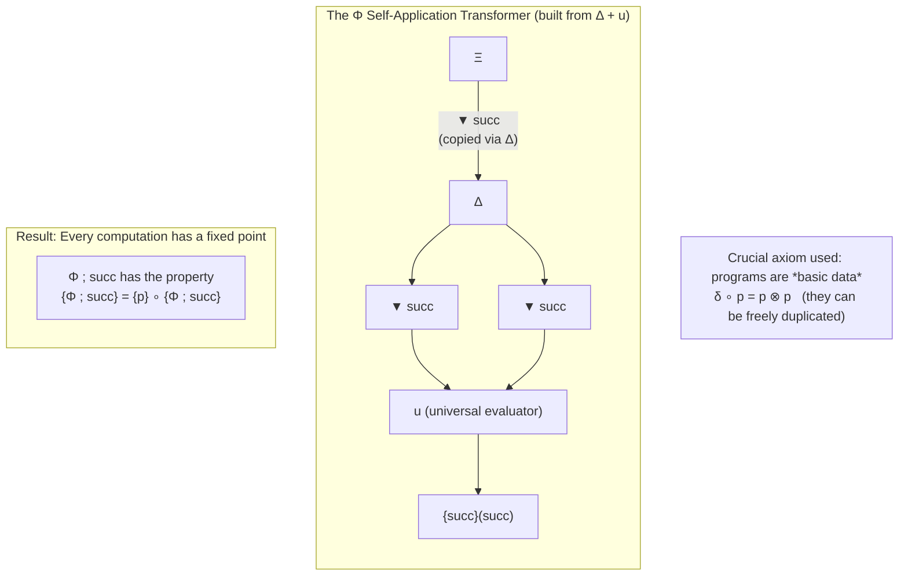

# Resource Diagrams

[](https://github.com/resource-diagrams/resource-diagrams/actions/workflows/ci.yml)
[](https://www.apache.org/licenses/LICENSE-2.0)
[](https://www.python.org/downloads/)

**String diagrams for modeling AI agent systems using monoidal category theory. Makes policy and tool copying, information flow, and resource usage explicit and analyzable.**

Resource Diagrams is a self-contained Python library for modeling AI agent systems with string diagrams grounded in monoidal category theory. It provides formal constructions and practical tools for representing policy copying, tool use, memory, and information flow in agent scaffolds. The approach makes structural properties of agent systems visible and analyzable in a precise, visual way.

The approach draws from formal models of computation that treat programs and processes as first-class data, making it possible to analyze transformations, resource usage, and certain security-relevant properties in a visual, compositional way.

## Motivation

Modern AI systems are complex, resource-consuming computational processes. Understanding their behavior — especially properties related to security, information flow, and the difficulty of certain transformations — is difficult with existing tools.

This project explores whether the graphical language of string diagrams, combined with the underlying formal structure of monoidal categories, can provide clearer and more rigorous ways to model and analyze these systems.

The work is grounded in the "Monoidal Computer" framework developed by Dusko Pavlovic and colleagues, which was originally motivated by the need for high-level tools to reason about computational resources in the context of security.

## Current Status

The library provides a faithful implementation of the core structures from Monoidal Computer Paper I (data services as comonoids, universal and partial evaluators, diagrammatic fixed-point construction) together with practical modeling idioms for AI systems (ReAct-style loops, resource and token accounting, information-flow analysis).

The library provides a faithful, executable implementation of the core structures from Monoidal Computer Paper I together with a diagrams construction layer and higher-level modeling idioms for AI/agent systems:

- `Object`, `Morphism`, `DataService` (Δ copy, ⊤ delete) and `MonoidalComputer` (universal/partial evaluators + the fixed-point construction of Paper I §6)
- `diagrams` layer: `StringDiagram`, `MermaidRenderer` with direct support for reproducing the four canonical paper figures programmatically (and generalizing them to agent/resource models)
- `models` layer: builders for ReAct-style loops, token accounting, information channels, etc., each returning diagrams plus explicit (illustrative) safety insights visible from the wiring geometry

All core functionality is self-contained (pure Python, no external services required). See `examples/` and `notebooks/` for runnable demonstrations.

The project follows semantic versioning and maintains a public changelog. We treat the fidelity of the underlying categorical constructions as a core maintenance responsibility.

## Relevance to Understanding Agent Systems

The string diagram formalism, grounded in the theory of monoidal categories and data services, offers a precise and visual way to represent the flow of data, control, and resources in computational processes. When applied to contemporary AI agent systems, it makes explicit several distinctions that are often only implicit in code: the difference between copyable program-like elements (policies, tool definitions) and non-copyable data (user inputs, observations, transient state), the structure of resource consumption alongside computation, and the geometry of information flow through loops and branching.

Resource Diagrams implements these ideas in executable form and provides higher-level modeling constructs for common agent patterns (ReAct-style loops, memory sharing, tool invocation). The resulting diagrams and structural analysis can help researchers and engineers reason more clearly about the behavior and properties of such systems.

One area where this approach has proven particularly illuminating is the modeling of information flow and persistence in agent scaffolds. The explicit representation of copying operations (Δ) versus deletion or linear use (⊤) makes certain structural features of these systems directly visible and amenable to analysis. The library includes tools for constructing and inspecting such diagrams programmatically.

## Quickstart

```bash
pip install resource-diagrams
```

```python
from resource_diagrams import MonoidalComputer
from resource_diagrams.diagrams import MermaidRenderer
from resource_diagrams.models import build_simple_react_diagram

# 1. Reproduce the fixed-point theorem (Paper I p.26)
mc = MonoidalComputer()
fp_code, meaning = mc.build_fixed_point("succ")
print(fp_code, meaning)

# 2. Emit the exact diagram from the paper
print(MermaidRenderer().render_fixed_point_construction("succ"))

# 3. Model a ReAct loop and read the safety property it makes visible
d = build_simple_react_diagram(tools=["search"], cycles=1)
print(d.to_mermaid())
print(d.safety_explanation)

# 4. (New) Use the structural analyzer for machine-readable insights
from resource_diagrams import analyze_safety_geometry
if d.string_diagram:
    print(analyze_safety_geometry(d.string_diagram))
```

### Example Diagram (Paper I fixed-point construction)



**For different audiences:**
- **AI safety / oversight researchers**: Model ReAct and tool-use scaffolds to surface policy-copying vs. one-way leakage surfaces (see `notebooks/reproducing_paper_i.py` and `examples/react_loop.py`).
- **Agent builders & engineers**: Use the builders (including the new guarded vs unguarded contrast) to visualize proposed scaffold changes and make copy vs. one-way decisions explicit in design reviews.
- **LangGraph users and maintainers**: Transcribe StateGraph constructions to structural diagrams for audit without pulling in LangGraph at review time (see `docs/recipe_langgraph.md` and `examples/langgraph_style_transcription.py`).
- **Formal methods / category theory researchers**: Faithful executable implementation of Paper I (data services, evaluators, diagrammatic fixed-point) with structural verification in the test suite.
- **OSS maintainers of agent frameworks**: A lightweight, zero-dependency review artifact that makes Δ policy forks and one-way channel lifetimes explicit and countable in PRs and design docs.

See the full worked scripts in `examples/` (especially `fixed_point_demo.py`, `guarded_contrast.py`, `langgraph_style_transcription.py`, `react_loop.py`, `reflexion_loop.py`, and `diagram_export.py`) and the literate walkthroughs in `notebooks/`. For a curated visual gallery of the key security surfaces, see [docs/gallery.md](docs/gallery.md). A dedicated transcription recipe for LangGraph users appears in [docs/recipe_langgraph.md](docs/recipe_langgraph.md).

For detailed examples of modeling information flow in agent systems, see [docs/diagrammatic-modeling-of-agent-information-flow.md](docs/diagrammatic-modeling-of-agent-information-flow.md).

The models layer now includes a lightweight `analyze_safety_geometry` tool for machine-readable insights into Δ vs. one-way structure.

- `notebooks/getting_started.py` — gentle introduction
- `notebooks/reproducing_paper_i.py` — reproduction of the fixed-point construction of Paper I p.26 together with a ReAct-style scaffold exhibiting explicit policy copies versus one-way channels. All diagrams and annotations are generated via the public API.

## Goals

- Provide a practical implementation of these diagrammatic techniques in Python
- Develop useful idioms for modeling real AI systems and their resource properties
- Create worked examples that demonstrate value for analysis and oversight
- Remain fully self-contained and usable without external services for core functionality

This work is intended as foundational infrastructure for the analysis and oversight of increasingly agentic AI systems. Clear, formal, visual modeling of resources and information flow can reduce the long-term security and maintenance burden on builders and auditors of complex agent scaffolds.

## Installation

```bash
git clone https://github.com/resource-diagrams/resource-diagrams.git
cd resource-diagrams

# Direct execution from a fresh clone (no installation required):
python examples/fixed_point_demo.py

# Recommended for development and reuse:
python -m venv .venv && source .venv/bin/activate
pip install -e ".[dev]"
python examples/fixed_point_demo.py
```

Once published on PyPI:

```bash
pip install resource-diagrams
```

## Usage

The primary interface for most users is the combination of the core model and the diagrams layer. The examples directory contains complete, self-contained scripts:

- `examples/fixed_point_demo.py` — exact reproduction of Paper I p.26 with live Mermaid and construction trace.
- `examples/simple_agent_resource_model.py` — ReAct loop via the models layer, showing one-way user input, policy copies, resource wires, and the safety insight made visible.
- `examples/data_services_programs.py` — why programs-as-data + explicit copy/delete turns information flow questions into questions about diagram geometry.
- `examples/diagram_export.py` — (re)generates the four canonical paper figures (01-04) as .mmd files using only the diagrams layer. (05/06 AI model diagrams in exports/ are committed snapshots produced by models examples such as `react_loop.py`.)

```python
# Minimal core + diagrams usage (copy-paste from examples/fixed_point_demo.py)
from resource_diagrams import MonoidalComputer, DataService, Object
from resource_diagrams.diagrams import MermaidRenderer

mc = MonoidalComputer()
p1, p2 = DataService.copy("my_policy", Object("Ξ"))
print(mc.build_fixed_point("my_policy"))
print(MermaidRenderer().render_fixed_point_construction("my_policy"))
```

Full details and outputs are in the `examples/` and `notebooks/` directories. Running `python examples/diagram_export.py` (re)generates exactly the four paper figure `.mmd` files (01-04) under `examples/exports/`. The AI modeling diagrams (05_react..., 06_agent...) are snapshots from the models examples. All promoted examples and both notebooks are reliably runnable via a single `python <path>.py` command from a fresh clone (bootstrap guards handle import resolution).

A detailed project description is available in [ABOUT.md](ABOUT.md).

## Relationship to the Papers

This library draws on ideas from the following works on string diagrams and categorical models of computation:

- Monoidal Computer I: Basic computability by string diagrams (Dusko Pavlovic, 2012) — core constructions implemented.
- Related work on normal complexity and coalgebraic views of computation — informs longer-term directions.

The focus is on making these formal methods useful for understanding structure and information flow in modern AI systems. See ROADMAP.md for current scope and future directions.

## Contributing

See `CONTRIBUTING.md`.

## License

MIT

---

*This is a genuine research and engineering effort. The goal is to explore whether these formal diagrammatic methods can be made useful for understanding and securing advanced AI systems.*
