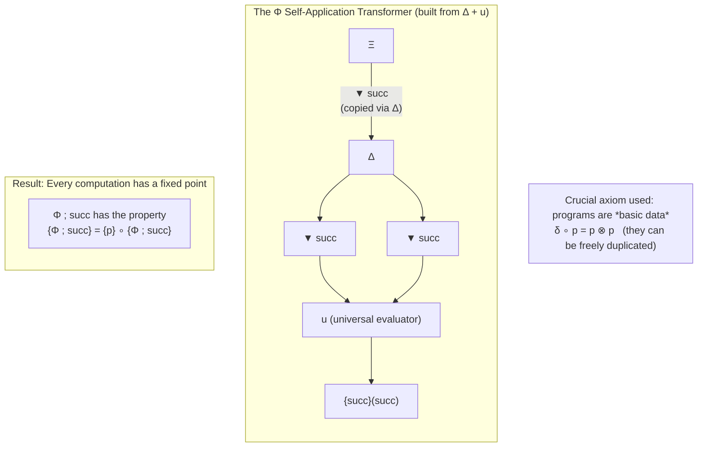

# Resource Diagrams

> **Note**: This is an early experimental prototype. Language in this document and related files should be read with that in mind. It is not a published package, not a rigorous formal-methods library, and not a security analysis tool.

[](https://www.apache.org/licenses/LICENSE-2.0)
[](https://www.python.org/downloads/)

**String diagrams for visualizing policy copying vs. one-way data channels in agent systems using ideas from monoidal category theory.**

Resource Diagrams is a self-contained Python library for building string diagrams grounded in monoidal category theory. It provides constructions and tools for making the distinction between copyable policy/tool elements and one-way data channels explicit in diagrams of agent scaffolds. The goal is to make certain structural distinctions visible for visualization and design review.

The approach draws from formal models of computation that treat programs and processes as first-class data, making certain distinctions around copying and linear use visible in a visual, compositional way.

## Motivation

Modern AI systems are complex, resource-consuming computational processes. Understanding their behavior — especially properties related to security, information flow, and the difficulty of certain transformations — is difficult with existing tools.

This project explores whether the graphical language of string diagrams, combined with the underlying formal structure of monoidal categories, can provide clearer and more rigorous ways to model and analyze these systems.

The work is grounded in the "Monoidal Computer" framework developed by Dusko Pavlovic and colleagues, which was originally motivated by the need for high-level tools to reason about computational resources in the context of security.

## Current Status

This is an early-stage research prototype exploring how string-diagram techniques from the Monoidal Computer papers (Pavlovic et al.) can be used to make copyable policy/tool definitions versus one-way data channels explicit in agent systems.

The library provides:

- Basic categorical primitives (`Object`, `Morphism`, `DataService` with explicit Δ copy / ⊤ delete).
- A `diagrams` layer for building and rendering `StringDiagram`s (with Mermaid output).
- Higher-level modeling builders for common agent patterns (ReAct-style loops, hierarchical agents, Reflexion-style critics, multi-agent coordination).
- A structural analysis walker (`analyze_safety_geometry`) that surfaces copying and termination geometry in diagrams.

The fixed-point construction and evaluator are implemented as a symbolic model over program names and Python callables. They demonstrate the diagrammatic constructions from the papers but are not a rigorous formalization.

All core functionality is self-contained. See `examples/` and `notebooks/` for runnable demonstrations.

The project is not published on PyPI and remains an exploratory research artifact. It is not intended for production use.

## Relevance to Understanding Agent Systems

The string diagram formalism, grounded in the theory of monoidal categories and data services, offers a visual way to represent distinctions between copyable program-like elements and one-way data in computational processes.

Resource Diagrams provides constructions and higher-level modeling helpers for common agent patterns. The resulting diagrams can help make copying vs. linear-use geometry explicit for researchers and engineers reviewing or designing agent scaffolds.

The explicit Δ (copy) vs. ⊤ (linear/delete) distinction is intended to surface certain structural patterns in diagrams of agent systems. The library includes tools for building and inspecting such diagrams.

## Quickstart (from source)

This project is not yet published on PyPI. For now, run from a clone:

```python
from resource_diagrams import MonoidalComputer
from resource_diagrams.diagrams import MermaidRenderer
from resource_diagrams.models import build_simple_react_diagram

# 1. Demonstrate the fixed-point construction (inspired by Paper I p.26)
mc = MonoidalComputer()
fp_code, meaning = mc.build_fixed_point("succ")
print(fp_code, meaning)

# 2. Render the corresponding diagram
print(MermaidRenderer().render_fixed_point_construction("succ"))

# 3. Build a simple ReAct-style diagram and inspect its structure
d = build_simple_react_diagram(tools=["search"], cycles=1)
print(d.to_mermaid())
print(d.safety_explanation)

# 4. Run the structural analyzer
from resource_diagrams import analyze_safety_geometry
if d.string_diagram:
    geom = analyze_safety_geometry(d.string_diagram)
    print(geom)
    # New: geom["policy_copy_vs_sensitive_reach_summary"] is an illustrative
    # structural metric (policy forks vs sensitive reach crossings) for review.
```

One CLI example (after `pip install -e ".[dev]"` or equivalent editable install; see "Installation"):

```bash
resource-diagrams demo fixed-point
```

### Example Diagram (fixed-point construction inspired by Paper I)



**Intended audiences (exploratory use):**
- Researchers interested in diagrammatic visualization of agent information flow and policy vs. data distinctions.
- People building or reviewing agent scaffolds who want a lightweight way to draw and count copy vs. linear-use patterns.
- Anyone curious about applying ideas from the Monoidal Computer papers to concrete modeling examples.

This is not positioned as a production security tool or a complete formal-methods library.

See the full worked scripts in `examples/` (especially `fixed_point_demo.py`, `guarded_contrast.py`, `langgraph_style_transcription.py`, `react_loop.py`, `reflexion_critique.py`, and `diagram_export.py`) and the literate walkthroughs in `notebooks/`. For a curated visual gallery of example diagrams, see [docs/gallery.md](docs/gallery.md). A dedicated transcription recipe for LangGraph users appears in [docs/recipe_langgraph.md](docs/recipe_langgraph.md).

For detailed examples of modeling information flow in agent systems, see [docs/diagrammatic-modeling-of-agent-information-flow.md](docs/diagrammatic-modeling-of-agent-information-flow.md).

The models layer includes an `analyze_safety_geometry` helper that performs basic structural counting of copy and termination nodes in diagrams.

- `notebooks/getting_started.py` — gentle introduction
- `notebooks/reproducing_paper_i.py` — an example demonstrating the fixed-point construction idea together with a ReAct-style scaffold. All diagrams and annotations are generated via the public API.

## Scope and Intent

This is an **early experimental prototype**. Its goals are:

### Running the tests

After `pip install -e ".[dev]"`, you can run:

```bash
python -m pytest
```

Expect some failures in the current state (see "Current Limitations" above). The test suite is not yet in a stable, green state.

- Provide a small, runnable Python implementation of basic diagrammatic constructions inspired by the Monoidal Computer papers.
- Develop simple idioms for drawing agent-like structures that highlight copying vs. linear-use distinctions.
- Produce clear, self-contained examples that make those distinctions visible.

### Current Limitations (as of this release)

- The implementation is a **symbolic model** over string program names and Python callables. It is not a faithful or complete formalization of the source papers.
- The fixed-point construction and evaluators are illustrative toys in an extended domain. They demonstrate the diagrammatic idea but do not constitute a rigorous computational model.
- `analyze_safety_geometry` / `generate_security_report` are lightweight structural linters. They count node types and emit heuristic text. They are **not** security analyzers.
- There is **no PyPI release** yet. The project is not packaged for distribution.
- Several tests are currently failing (primarily around non-basic value copying semantics and tensor representation). These areas are still evolving.

This project should be approached as an early-stage research prototype. It is not production tooling and does not provide strong security or formal guarantees. Substantial additional work would be required before responsible use in high-stakes settings.

## Installation / Running

There is no PyPI release yet. Clone the repository and run examples directly:

```bash
git clone https://github.com/formalsymbolic/resource-diagrams.git
cd resource-diagrams
python examples/fixed_point_demo.py
```

For development:

```bash
python -m venv .venv
source .venv/bin/activate
pip install -e ".[dev]"
```

## Usage

The primary interface for most users is the combination of the core model and the diagrams layer. The examples directory contains complete, self-contained scripts:

- `examples/fixed_point_demo.py` — programmatic reconstruction (via the diagrams layer) of the diagrammatic structure of the fixed-point construction from Paper I p.26, rendered live as Mermaid (illustrative symbolic model).
- `examples/simple_agent_resource_model.py` — ReAct loop via the models layer, showing one-way user input, policy copies, resource wires, and structural distinctions made visible.
- `examples/data_services_programs.py` — why programs-as-data + explicit copy/delete turns information flow questions into questions about diagram geometry.
- `examples/diagram_export.py` — (re)generates Mermaid reconstructions of the diagrammatic structure of the four canonical paper figures (01-04) using only the diagrams layer (illustrative of the visual forms in the source papers). Later agent modeling diagrams in `exports/` are snapshots produced by the models layer examples.

```python
# Minimal core + diagrams usage (copy-paste from examples/fixed_point_demo.py)
from resource_diagrams import MonoidalComputer, DataService, Object
from resource_diagrams.diagrams import MermaidRenderer

mc = MonoidalComputer()
p1, p2 = DataService.copy("my_policy", Object("Ξ"))
print(mc.build_fixed_point("my_policy"))
print(MermaidRenderer().render_fixed_point_construction("my_policy"))
```

Full details and outputs are in the `examples/` and `notebooks/` directories. Running `python examples/diagram_export.py` (re)generates exactly the four paper figure `.mmd` files (01-04) under `examples/exports/`. The AI modeling diagrams (05_react..., 06_agent...) are snapshots from the models examples. All promoted examples and both notebooks are reliably runnable via a single `python <path>.py` command from a fresh clone (bootstrap guards handle import resolution).

A detailed project description is available in [ABOUT.md](ABOUT.md).

## Relationship to the Papers

This library draws on ideas from the following works on string diagrams and categorical models of computation:

- Monoidal Computer I: Basic computability by string diagrams (Dusko Pavlovic, 2012) — core constructions implemented.
- Related work on normal complexity and coalgebraic views of computation — informs longer-term directions.

The focus is on making these formal methods useful for understanding structure and information flow in modern AI systems. See ROADMAP.md for current scope and future directions.

## Contributing

See `CONTRIBUTING.md`.

## License

Apache 2.0

See the [LICENSE](LICENSE) file for details.

---

*This is a genuine research and engineering effort. The goal is to explore whether these formal diagrammatic methods can be made useful for understanding and securing advanced AI systems.*
